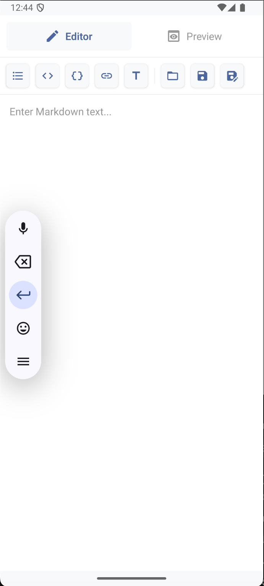

# Mobile Markdown Editor (MDE)

MDE is a android application built with Expo and React Native. It provides a seamless Markdown writing and preview experience with file import support on native platforms.

## Features
- **Live Editor & Preview**: Toggle between a rich Markdown editor and a formatted preview.
- **Toolbar Shortcuts**: Quickly insert lists, headings, code blocks, inline code, and links.
- **File Import**: Open Markdown files from the device (Android intent support).

## Screenshots

